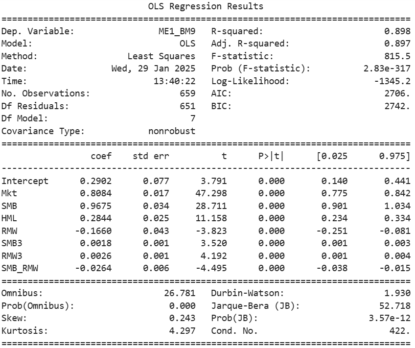
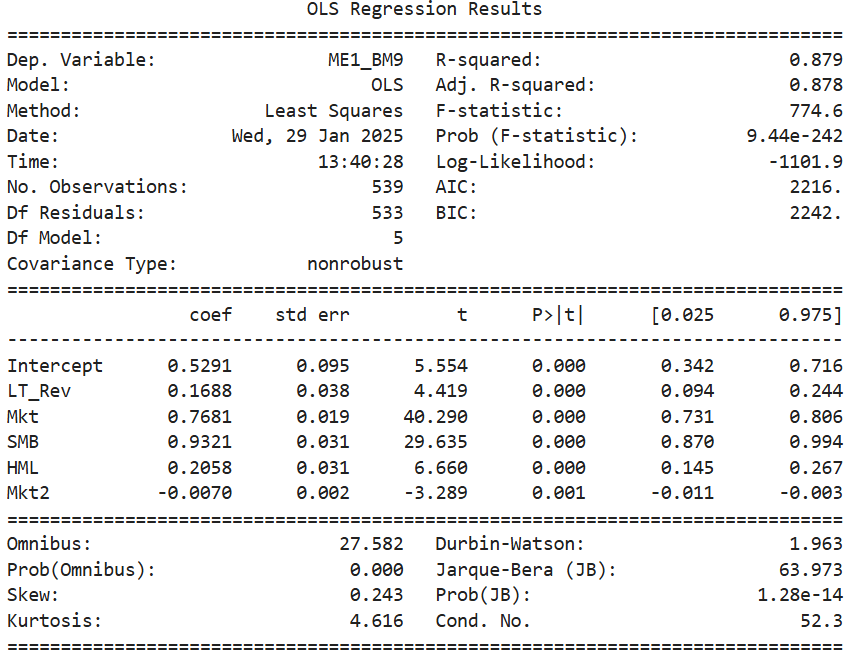
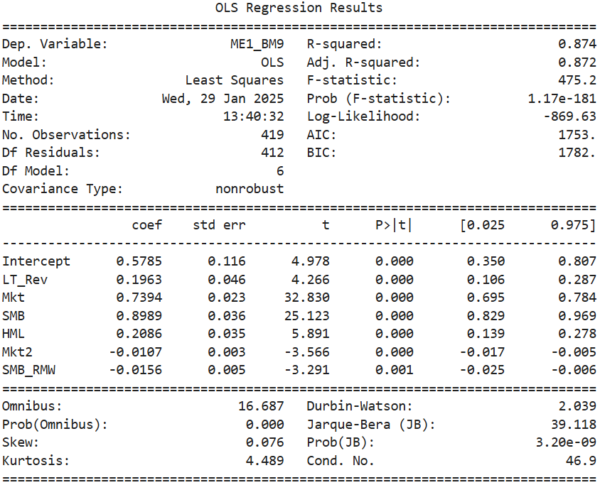

## Polynomial Fama-French 5 Factor Model with Interactions

#### Code
~~~python
import numpy as np
import pandas as pd
import matplotlib.pyplot as plt
import yfinance as yf
import datetime as dt
from statsmodels.formula.api import ols
from statsmodels.api import qqplot
from sklearn.model_selection import train_test_split
import pandas_datareader.data as web
from pandas_datareader.famafrench import get_available_datasets
from statsmodels.stats.anova import anova_lm

import warnings
warnings.filterwarnings("ignore")
~~~

~~~python
start  = '1970-01-01'
end ='2024-11-27'
factors = web.DataReader('F-F_Research_Data_5_Factors_2x3','famafrench', start=start ,end=end)[0]
ports = web.DataReader('100_Portfolios_10x10','famafrench', start=start ,end=end)[0]
ports = ports.sub(factors.RF, axis=0)
ports.columns = ports.columns.str.replace(' ', '_')
#print(factors)
#print(ports.columns)
~~~

~~~python
mom = web.DataReader('F-F_Momentum_Factor','famafrench', start=start ,end=end)[0]
st_rev = web.DataReader('F-F_ST_Reversal_Factor','famafrench', start=start ,end=end)[0]
lt_rev = web.DataReader('F-F_LT_Reversal_Factor','famafrench', start=start ,end=end)[0]
factors = pd.merge(mom, factors, on='Date')
factors = pd.merge(st_rev, factors, on='Date')
factors = pd.merge(lt_rev, factors, on='Date')
factors.drop(['RF'], axis=1, inplace=True)
#print(factors)
~~~

~~~python
factors.rename(columns={'Mom   ':'Mom', 'Mkt-RF':'Mkt'}, inplace=True)
factors['Mkt2']=factors['Mkt']**2
factors['HML2']=factors['HML']**2
factors['SMB2']=factors['SMB']**2
factors['RMW2']=factors['RMW']**2
factors['CMA2']=factors['CMA']**2
factors['Mom2']=factors['Mom']**2
factors['LT_Rev2']=factors['LT_Rev']**2
factors['ST_Rev2']=factors['ST_Rev']**2
factors['Mkt3']=factors['Mkt']**3
factors['HML3']=factors['HML']**3
factors['SMB3']=factors['SMB']**3
factors['RMW3']=factors['RMW']**3
factors['CMA3']=factors['CMA']**3
factors['Mom3']=factors['Mom']**3
factors['LT_Rev3']=factors['LT_Rev']**3
factors['ST_Rev3']=factors['ST_Rev']**3
factors['Mkt_HML']=factors['Mkt']*factors['HML']
factors['Mkt_SMB']=factors['Mkt']*factors['SMB']
factors['Mkt_RMW']=factors['Mkt']*factors['RMW']
factors['Mkt_CMA']=factors['Mkt']*factors['CMA']
factors['Mkt_Mom']=factors['Mkt']*factors['Mom']
factors['SMB_HML']=factors['SMB']*factors['HML']
factors['SMB_RMW']=factors['SMB']*factors['RMW']
factors['SMB_CMA']=factors['SMB']*factors['CMA']
factors['HML_RMW']=factors['HML']*factors['RMW']
factors['HML_CMA']=factors['HML']*factors['CMA']
#print(factors)
~~~

~~~python
def back_elim(model, F_cutoff):
    ols_model = ols(model, df).fit()
    anova_results = anova_lm(ols_model,typ=2)
    F = anova_results.F
    while (np.min(F) < F_cutoff):
        if '+' + F.idxmin() == model[-(len(F.idxmin())+1):]:
            drop_end = '+' + F.idxmin()
            model = model.replace(drop_end, '')
        drop_start = str('~') + F.idxmin() + str('+')
        model = model.replace(drop_start, '~')
        drop_mid = str('+') + F.idxmin() + str('+')
        model = model.replace(drop_mid, '+')
        ols_model = ols(model, df).fit()
        anova_results=anova_lm(ols_model,typ=2)
        F = anova_results.F
    return model
~~~

~~~python
string = str('~')
for factor in factors.columns:
    string += factor+str('+')
string = string[0:-1]
~~~

~~~python
ports_1970, strings_1970, alphas_1970 = [], [], []

for port in ports.columns:
    df = pd.merge(ports.loc[:,port], factors, on='Date')
    new_string = f'{port}' + string 
    reduced_model = back_elim(new_string, 10)
    model=ols(reduced_model, df).fit()
    if model.pvalues[0]<.05:
        ports_1970.append(port)
        strings_1970.append(reduced_model)
        alphas_1970.append(model.params[0])
        
#print(ports_1970)
#print(alphas_1970)
~~~

~~~python
ports_1980, strings_1980, alphas_1980 = [], [], []

for port in ports.columns:
    df = pd.merge(ports.loc['1980-01':,port], factors, on='Date')
    new_string = f'{port}' + string 
    reduced_model = back_elim(new_string, 10)
    model=ols(reduced_model, df).fit()
    if model.pvalues[0]<.05:
        ports_1980.append(port)
        strings_1980.append(reduced_model)
        alphas_1980.append(model.params[0])
        
#print(ports_1980)
#print(alphas_1980)
~~~

~~~python
ports_1990, strings_1990, alphas_1990 = [], [], []

for port in ports.columns:
    df = pd.merge(ports.loc['1990-01':,port], factors, on='Date')
    new_string = f'{port}' + string 
    reduced_model = back_elim(new_string, 10)
    model=ols(reduced_model, df).fit()
    if model.pvalues[0]<.05:
        ports_1990.append(port)
        strings_1990.append(reduced_model)
        alphas_1990.append(model.params[0])
        
#print(ports_1990)
#print(alphas_1990)
~~~

~~~python
sig_ports = list(set(ports_1970) & set(ports_1980) & set(ports_1990))
print(sig_ports)
~~~
'ME4_BM10', 'SMALL_HiBM', 'ME4_BM9', 'ME2_BM1', 'ME8_BM6', 'SMALL_LoBM', 'ME10_BM7', 'ME3_BM6', 'ME9_BM10', 'ME3_BM9', 'ME1_BM9', 'ME7_BM4', 'BIG_HiBM'

~~~python
#1970
for p in sig_ports:
    df = pd.merge(ports.loc[:,p], factors, on='Date')
    model = ols(strings_1970[ports_1970.index(p)], df).fit()
    print(model.summary())   
~~~
e.g.

~~~python
#1980
for p in sig_ports:
    df = pd.merge(ports.loc['1980-01':,p], factors, on='Date')
    model = ols(strings_1980[ports_1980.index(p)], df).fit()
    print(model.summary()) 
~~~
e.g.

~~~python
#1990
for p in sig_ports:
    df = pd.merge(ports.loc['1990-01':,p], factors, on='Date')
    model = ols(strings_1990[ports_1990.index(p)], df).fit()
    print(model.summary())
~~~
e.g.

