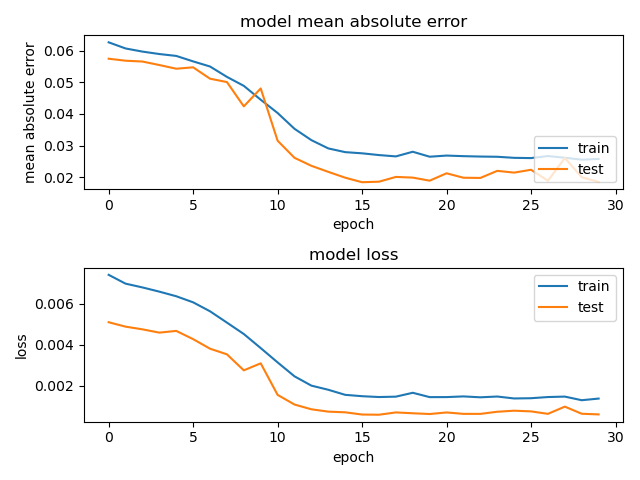
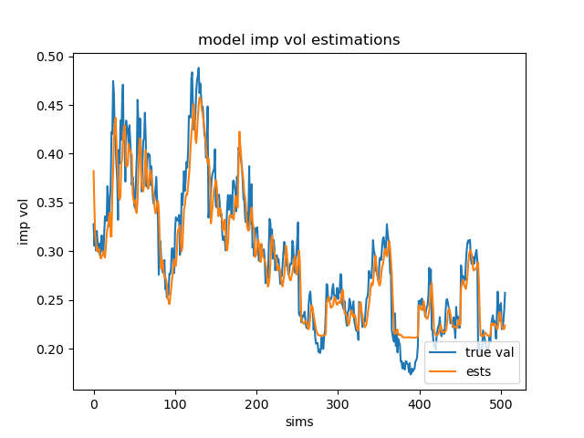

## LSTM ML Model of CBOE VIX on AAPL

#### Code
~~~python
import tensorflow as tf
from keras.models import Sequential
from keras.layers import Dense, LSTM, Dropout
from keras.metrics import MeanAbsoluteError
import pandas as pd
import numpy as np
import matplotlib.pyplot as plt

data1 = pd.read_csv('AAPL_VIX_train.csv')
data2 = pd.read_csv('AAPL_VIX_test.csv')

X = data1[['VXAPLCLS', 't+1', 't+2']]
train_x = np.reshape(X, (X.shape[0], X.shape[1], 1))
train_y = data1['t+3']

X_pre = data2[['VXAPLCLS', 't+1', 't+2']]
test_x = np.reshape(X_pre, (X_pre.shape[0], X_pre.shape[1], 1))
test_y = data2['t+3']
~~~

~~~python
model = Sequential()
model.add(LSTM(64, input_shape = (train_x.shape[1], train_x.shape[2]), activation='relu', return_sequences=True))
model.add(Dropout(0.3))
model.add(LSTM(128, activation='relu', return_sequences=False))
model.add(Dropout(0.3))
model.add(Dense(32))
model.add(Dense(1, activation='linear'))

# Create an SGD optimizer with a learning rate of 0.01
optimizer = tf.keras.optimizers.SGD(learning_rate=0.01)

# Compile the model
model.compile(optimizer=optimizer, loss='mse', metrics=[MeanAbsoluteError()])

history = model.fit(train_x, train_y, epochs=30, batch_size=1, verbose=2, validation_data=(test_x, test_y))
~~~
Epoch 1/30
2649/2649 - 14s - 5ms/step - loss: 0.0074 - mean_absolute_error: 0.0626 - val_loss: 0.0051 - val_mean_absolute_error: 0.0574\
Epoch 2/30
2649/2649 - 11s - 4ms/step - loss: 0.0070 - mean_absolute_error: 0.0607 - val_loss: 0.0049 - val_mean_absolute_error: 0.0568\
...\
Epoch 29/30
2649/2649 - 11s - 4ms/step - loss: 0.0013 - mean_absolute_error: 0.0255 - val_loss: 6.5068e-04 - val_mean_absolute_error: 0.0200\
Epoch 30/30
2649/2649 - 11s - 4ms/step - loss: 0.0014 - mean_absolute_error: 0.0258 - val_loss: 6.1802e-04 - val_mean_absolute_error: 0.0185

~~~python
model.save('./AAPL_VIX_model.keras')

fig = plt.figure()
plt.subplot(2,1,1)
plt.plot(history.history['mean_absolute_error'])
plt.plot(history.history['val_mean_absolute_error'])
plt.title('model mean absolute error')
plt.ylabel('mean absolute error')
plt.xlabel('epoch')
plt.legend(['train', 'test'], loc='lower right')

plt.subplot(2,1,2)
plt.plot(history.history['loss'])
plt.plot(history.history['val_loss'])
plt.title('model loss')
plt.ylabel('loss')
plt.xlabel('epoch')
plt.legend(['train', 'test'], loc='upper right')

plt.tight_layout()
plt.savefig('AAPL_VIX_train_history.png',format='png')
plt.show()
~~~

~~~python
y_est = model.predict(test_x)

fig = plt.figure()
plt.plot(test_y)
plt.plot(y_est)
plt.title('model imp vol estimations')
plt.ylabel('imp vol')
plt.xlabel('sims')
plt.legend(['true val', 'ests'], loc='lower right')
plt.savefig('AAPL_VIX_impvol_ests.png',format='png')
plt.show()
~~~

