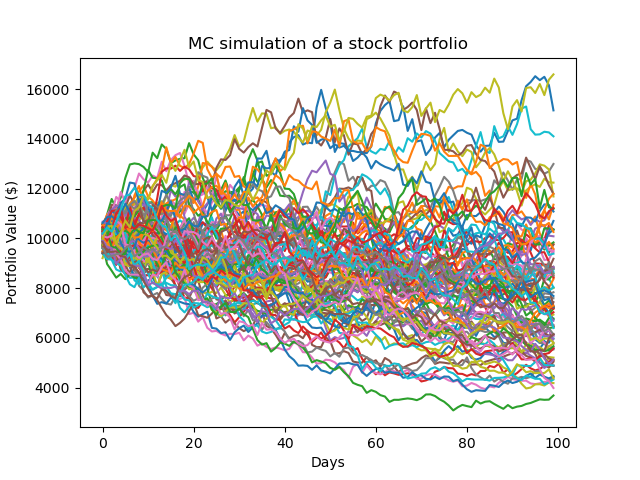
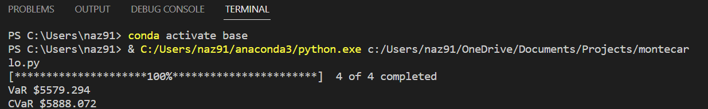

## Monte Carlo, VaR, and CVaR

#### Code 

~~~python
import pandas as pd
import numpy as np
import matplotlib.pyplot as plt
import datetime as dt
from pandas_datareader import data as pdr
import yfinance as yf

yf.pdr_override()

def get_data(stocks, start, end):
    stockData = pdr.get_data_yahoo(stocks, start, end)
    stockData = stockData['Close']
    returns = stockData.pct_change()
    meanReturns = returns.mean()
    covMatrix = returns.cov()
    return meanReturns, covMatrix

stockList = ['AMZN', 'NVDA', 'TSLA', 'GM']
stocks = [stock for stock in stockList]
endDate = dt.datetime.now()
startDate = endDate - dt.timedelta(days=300)

meanReturns, covMatrix = get_data(stocks, startDate, endDate)

weights = np.random.random(len(meanReturns))
weights /= np.sum(weights)

#montecarlo
mc_sims = 100 #num simulations
T = 100 #timeframe in days

meanM = np.full(shape= (T, len(weights)), fill_value=meanReturns)
meanM = meanM.T #transpose

portfolio_sims = np.full(shape=(T, mc_sims), fill_value=0.0)

initialPortfolio = 10000

for m in range(0, mc_sims):
    #using Cholesky decomp
    Z = np.random.normal(size=(T, len(weights)))
    L = np.linalg.cholesky(covMatrix) #works out lower triangle
    dailyReturns = meanM + np.inner(L, Z)
    portfolio_sims[:,m] = np.cumprod(np.inner(weights, dailyReturns.T)+1)*initialPortfolio

plt.plot(portfolio_sims)
plt.ylabel('Portfolio Value ($)')
plt.xlabel('Days')
plt.title('MC simulation of a stock portfolio')

def mcVaR(returns, alpha=5):
    if isinstance(returns, pd.Series):
        return np.percentile(returns, alpha)
    else:
        raise TypeError('Expected pandas data series')
    
def mcCVaR(returns, alpha=5):
    if isinstance(returns, pd.Series):
        belowVaR = returns <= mcVaR(returns, alpha=alpha)
        return returns[belowVaR].mean()
    else:
        raise TypeError('Expected pandas data series')
    
portResults = pd.Series(portfolio_sims[-1,:])

VaR = initialPortfolio - mcVaR(portResults, alpha=5)
CVaR = initialPortfolio - mcCVaR(portResults, alpha=5)

print('VaR ${}'.format(round(VaR,3)))
print('CVaR ${}'.format(round(CVaR,3)))
plt.show()
~~~

#### Description
I followed a tutorial on how to implement a monte carlo simulation that predicts the performance of a portfolio. First, it taught me how to use pandas_datareader to extract the historical pricing of a a stock. Then, I learned how to create a covariance matrix using .cov(). Prior to this I had only used Stata to assess covariance. The function .timedelta(), albeit simple, caught my attention as an addition I can make to my automated implied volatility calculator -- especially when I add dividend payouts into the calculations. The tutorial applied random weights to each stock, however, one would know their relative holdings within a portfolio in real life. Thus, the code could be altered such that the user inputs the percentage of the portfolio that is invested in each stock. As also in the geometric brownian motion practice, I gained the knowledge of how to create a matrix using the numpy built-in, .full(). But, here I further learned how to transpose a matrix simply with .T. Next, I was re-introduced to Cholesky decomposition (I had briefly crossed paths with the method in my Econometrics course) and implemented it using yet another numpy built-in, .linalg.cholesky(). It was useful to see the inner workings of a Monte Carlo simulation since, before watching this tutorial, I had only had experience with programs running the simulation for you and producing the results. Additionally, I learned how to calculate VaR (Value at Risk) and CVaR (Conditional Value at Risk). VaR in the code produces the maximum amount you might lose on the portfolio with 95% confidence. CVaR produces the average loss on the portfolio you would suffer if it were to cross that threshold.

#### Output
The predictive graph produced for the stock list specified and the random weightings assigned to those stocks by the program is shown below. VaR and CVaR are calculated to be 5579.294 and 5888.072, respectively.

