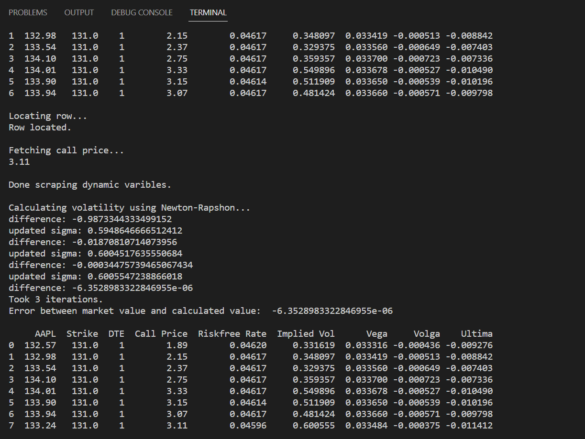
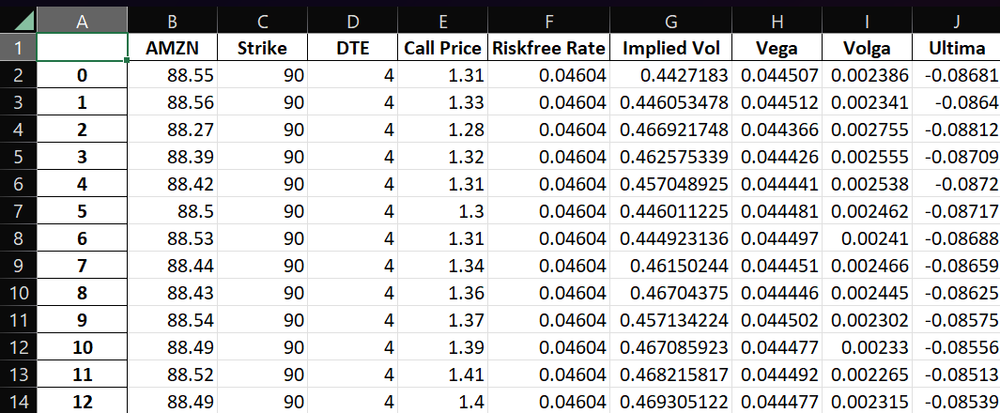
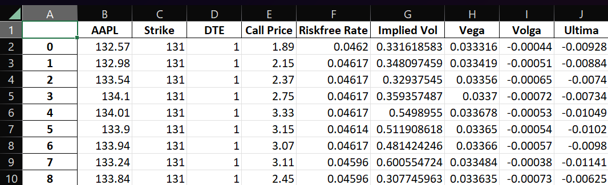

### Automated Implied Volatility Calculator

#### Brief Summary
I designed a web scraper that gathers the market price of the underlying asset, the market price of the call option, and the risk-free rate in real time. The user inputs the stock, the strike price, and the time to maturity that is of interest to them. Then, the implementation of the Newton-Raphson method (with some improvements -- see later on) calculates the implied volatility at that instant. Furthermore, vega, volga, and ultima are calculated. The program runs according to a specified time interval until the market closes. Nonetheless, it will produce a single row of data after close if the user wishes to check their current position after the trading day. All of the data is continuously placed into a dataframe that uploads to an Excel file. 

#### Code

~~~python
from cgitb import text
from importlib.resources import path
from selenium import webdriver
from selenium.webdriver.common.by import By
from time import time, sleep
from datetime import datetime
import pandas as pd
from concurrent.futures import ThreadPoolExecutor
import numpy as np
from scipy.stats import norm
from selenium.webdriver.support.ui import WebDriverWait
from selenium.webdriver.support import expected_conditions as EC

N_prime = norm.pdf
N = norm.cdf 
url = ['', '', 'https://www.wsj.com/market-data/quotes/bond/BX/TMUBMUSD03M'] 

options = webdriver.ChromeOptions()
options.add_experimental_option('excludeSwitches', ['enable-logging'])
browser = webdriver.Chrome(options=options)
executor = ThreadPoolExecutor(max_workers=20)
~~~

~~~python
def check_time():
    now = datetime.now()
    midnight = now.replace(hour=0, minute=0, second=0, microsecond=0)
    secs = (now - midnight).seconds
    return secs

def explicit_wait(delay, xpath):
    try:
        temp = WebDriverWait(browser, delay).until(EC.visibility_of_element_located((By.XPATH, xpath)))
    except TimeoutError:
        print('Failed to locate element')
    return browser.find_element(By.XPATH, xpath).text

def find_xpath(val):
    print('\nLocating row...')
    row = 1
    xpath = '//*[@id="Col1-1-OptionContracts-Proxy"]/section/section/div[2]/div/table/tbody/tr[1]/td[6]'
    browser.get(url[1])
    q = explicit_wait(10, xpath)
    while float(q) != float(val):
        row += 1
        xpath = f'//*[@id="Col1-1-OptionContracts-Proxy"]/section/section/div[2]/div/table/tbody/tr[{row}]/td[6]'
        q = explicit_wait(10, xpath)
    print('Row located.') 
    return xpath.replace(f'{xpath[-2:-1]}', '1')

def get_price(val = 0):
    sleep(1)
    if val == 0:
        #underlying asset price
        browser.get(url[0])
        price = browser.find_element(By.XPATH, '//*[@id="quote-header-info"]/div[3]/div[1]/div[1]/fin-streamer[1]').text
    else:
        #market price of call option
        x = find_xpath(val)
        print('\nFetching call price...')
        price = explicit_wait(10, x)
        print(price)
    p = '{0:.2f}'.format(float(price))
    return float(p)

def get_rf():
    #risk-free rate
    sleep(1)
    browser.get(url[2])
    xpath = '//*[@id="quote_val"]'
    rate = explicit_wait(10, xpath)
    r = rate.replace('%', '')
    return float(r)
~~~

~~~python
def bs_call(S, K, T, rf, sigma):
    #program handles black-scholes (european) call options
    d1 = (np.log(S / K) + (rf + sigma ** 2 / 2) * T) / sigma * np.sqrt(T)
    d2 = d1 - sigma * np.sqrt(T)
    call = S * N(d1) -  N(d2)* K * np.exp(-rf * T)
    return call

def vega(S, K, T, rf, sigma): 
    d1 = (np.log(S / K) + (rf + sigma ** 2 / 2) * T) / sigma * np.sqrt(T)
    vega = S * N_prime(d1) * np.sqrt(T)
    return vega

def volga(S, K, T, rf, sigma):
    d1 = (np.log(S / K) + (rf + sigma ** 2 / 2) * T) / sigma * np.sqrt(T)
    d2 = d1 - sigma * np.sqrt(T)
    volga = vega(S, K, T, rf, sigma) * (d1*d2)/sigma
    return volga

def ultima(S, K, T, rf, sigma):
    d1 = (np.log(S / K) + (rf + sigma ** 2 / 2) * T) / sigma * np.sqrt(T)
    d2 = d1 - sigma * np.sqrt(T)
    temp = (-1 * vega(S, K, T, rf, sigma)) / (sigma ** 2)
    ultima = temp * ((d1 * d2) * (1 - d1 * d2) + (d1 ** 2) + (d2 ** 2))
    return ultima
~~~

~~~python
def impvol_call(C, S, K, T, rf, err=0.0001, max=100):
    print('\nCalculating volatility using Newton-Rapshon...')

    #initial volatility estimate
    sigma = 0.3

    for i in range(max):
        #difference between calculated price and market price (error measurement)
        diff = bs_call(S, K, T, rf, sigma) - C
        print(f'difference: {diff}')
        
        #break if difference < specified 'err' (error tolerance)
        if abs(diff) < err:
            print(f'Took {i} iterations.')
            print(f'Error between market value and calculated value:  {diff}\n')
            break

        #correction for zero approach in newton-rapshon (taylor series expansion and manipulation)
        if vega(S, K, T, rf, sigma) < 1:
            sigma = sigma + ((3 * volga(S, K, T, rf, sigma))/(ultima(S, K, T, rf, sigma)))

        #newton-rapshon to update the estimate
        sigma = sigma - (diff / vega(S, K, T, rf, sigma))
        print(f'updated sigma: {sigma}')

    return sigma
~~~

~~~python
def main():
    now = datetime.now()
    date = now.strftime('%m-%d-%Y')

    stock = input('Stock: ')
    url[0] = f'https://finance.yahoo.com/quote/{stock}/'
    url[1] = f'https://finance.yahoo.com/quote/{stock}/options?p=NVDA&straddle=true'
    path = f'C:/Users/naz91/OneDrive/Documents/Projects/DailyStats/{date}-{stock}.xlsx'

    K = float(input('Strike price: '))
    dte = int(input('Days until expiration: '))
    T = dte / 252
~~~

~~~python
    with ThreadPoolExecutor(max_workers=20) as executor:
        price = executor.submit(get_price)
        S = price.result()
        callprice = executor.submit(get_price, (K))
        C = callprice.result()
        rfrate = executor.submit(get_rf)
        rf = rfrate.result()

    print('\nDone scraping dynamic varibles.')
~~~

~~~python
    rf /= 100
    iv = impvol_call(C, S, K, T, rf)
    veg = .01 * vega(S, K, T, rf, iv)
    volg = volga(S, K, T, rf, iv)
    ult = ultima(S, K, T, rf, iv)

    df = pd.DataFrame([(S, K, dte, C, rf, iv, veg, volg, ult)], columns=[stock, 'Strike', 'DTE', 'Call Price', 'Riskfree Rate', 'Implied Vol', 'Vega', 'Volga', 'Ultima'])
    print(df)
~~~

~~~python
    try:
        while True:
            if (check_time() > 57600):
                break

            sleep(900)

            with ThreadPoolExecutor(max_workers=20) as executor:
                price = executor.submit(get_price)
                S = price.result()
                callprice = executor.submit(get_price, (K))
                C = callprice.result()
                rfrate = executor.submit(get_rf)
                rf = rfrate.result()

            print('\nDone scraping dynamic varibles.')

            rf /= 100
            iv = impvol_call(C, S, K, T, rf)
            veg = .01 * vega(S, K, T, rf, iv)
            volg = volga(S, K, T, rf, iv)
            ult = ultima(S, K, T, rf, iv)

            df2 = pd.DataFrame([(S, K, dte, C, rf, iv, veg, volg, ult)], columns=[stock, 'Strike', 'DTE', 'Call Price', 'Riskfree Rate', 'Implied Vol', 'Vega', 'Volga', 'Ultima'])
            df = pd.concat([df, df2], ignore_index=True)
            print(df)
            df.to_excel(path)

        browser.close()

    except KeyboardInterrupt:
        #Ctrl-C terminates program (manual stop)
        exit

if __name__ == '__main__':
    main()
~~~

#### Functionality
Below is an image of the terminal during runtime. It first collects the user input for stock, strike price, and days until expiration. Then, it scrapes the market price of the underlying asset. In order to find the market price of the option it begins at the top of the straddle and iterates through the strike prices until it finds the row containing the strike price input by the user. The program subsequently moves over the the Last Price column and scrapes the option price. Lastly, it scrapes the risk-free rate, calculates, and appends the findings to the dataframe.

#### Data Examples
Note the path label in the code of the program above. I have it so the Excel file is marked by the date followed by the name of the stock for orginizational purposes. I provide data from two stocks on different days with different runtime intervals. 

Data from AMZN on January 9, 2023 from 2:04 p.m. to 2:16 p.m. at a runtime interval of 1 minute.

Data from AAPL on January 12, 2023 from 11:51 a.m. to 2:51 p.m. at a runtime interval of 15 minutes.

#### Upcoming Improvements
As aforementioned, the Black-Scholes formula and its derivatives with respect to implied volatility used in the program do not take into account dividend payoffs. Ergo, an easy update would be to scrape the dividend payoffs of the stock and substitute the formulas that include a measure for dividends. 
The program also only considers call options. An obvious expansion would be to insert the Black-Scholes formula for put options, update the derivatives with respect to volatility to encompass their put option alternatives, and augment functions such as get_price and impvol_calc. 
I do not intend to make the transition from European option to American option calculations as I was primarily focused on integrating the Newton-Raphson method with the functional improvements brought about through Taylor Series expansion. That said, I plan to work on a binomial pricing model for American options in the future.
