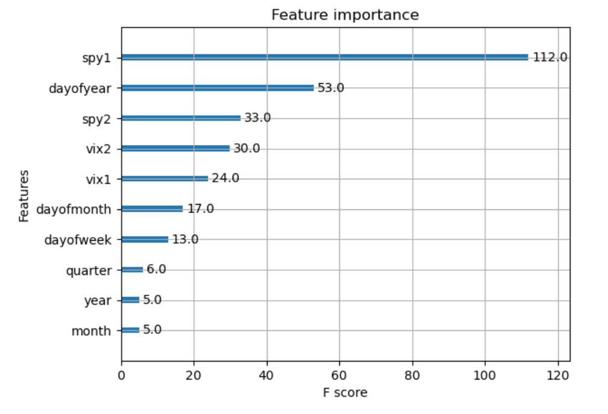
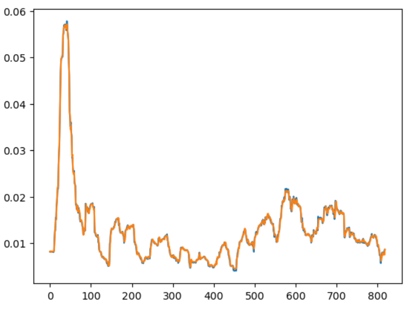
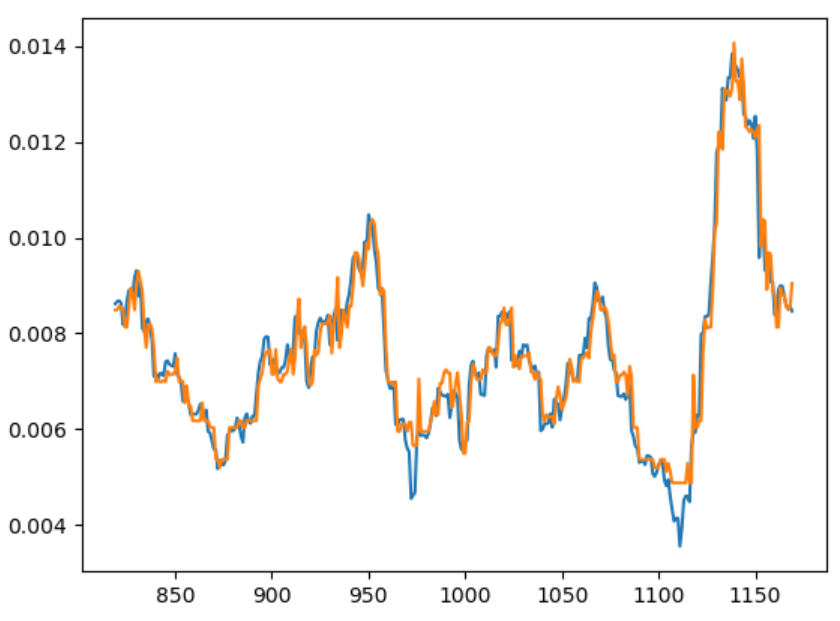
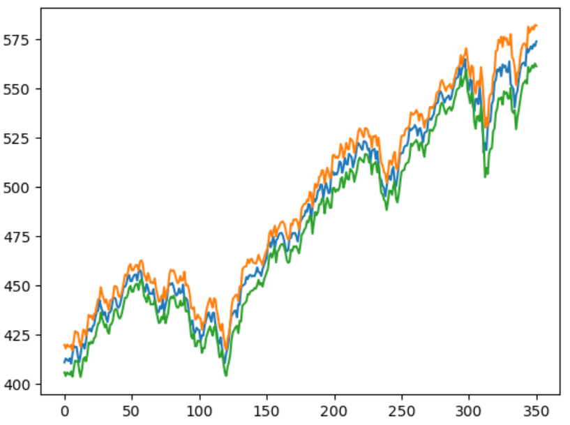
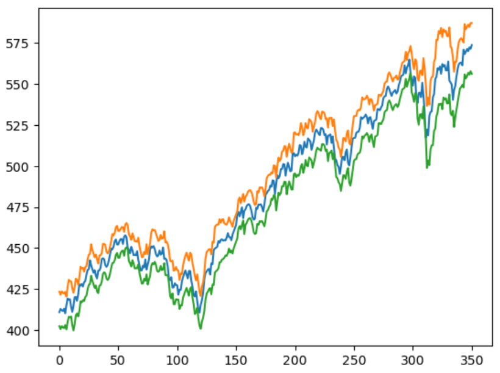
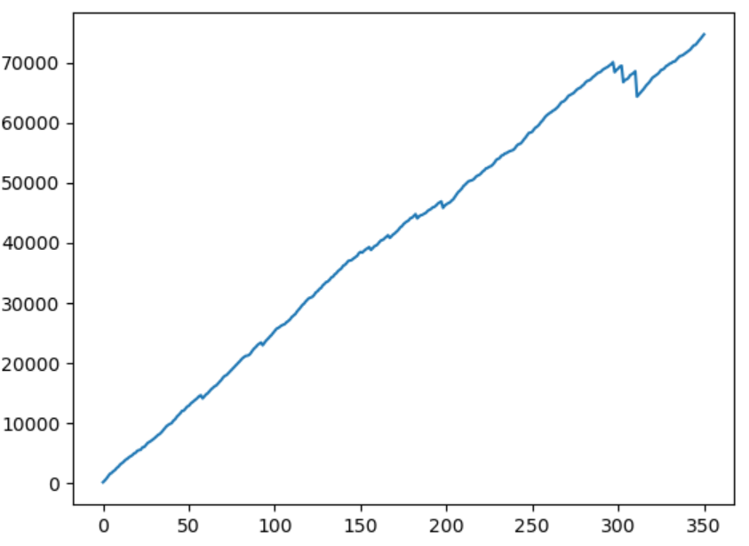

## XGBoost SPY Iron Condor Options Strategy

#### Code
~~~python
import yfinance as yf
import pandas as pd
import numpy as np
import matplotlib.pyplot as plt
from sklearn.model_selection import train_test_split
from scipy.linalg import expm
from scipy.optimize import root
import xgboost as xgb
import datetime as dt
from xgboost import plot_importance, plot_tree
from sklearn.metrics import mean_absolute_error as mae
from sklearn.metrics import root_mean_squared_error as rmse
from sklearn.metrics import r2_score
~~~

~~~python
spy = yf.download("SPY", start="2020-01-01", end="2024-10-01")
spy = spy['Close']
spy_diff = np.log(spy).diff().dropna()
#print(len(spy_diff))
#spy_diff.head()
~~~

~~~python
rolling = abs(spy_diff.rolling(window=22, min_periods=22).std().dropna())
print(len(rolling))
#rolling.head()
~~~

~~~python
rolling=pd.DataFrame(rolling)
rolling.reset_index(inplace=True)
rolling['Lag1'] = rolling['Close'].shift(1)
rolling['Lag2'] = rolling['Close'].shift(2)
rolling = rolling.dropna()
rolling.reset_index(inplace=True)
rolling.drop('index', axis=1, inplace=True)
#print(rolling)
~~~

~~~python
train, test = train_test_split(rolling, train_size=0.7, shuffle=False)
#test.head()
~~~

~~~python
vix = yf.download("^VIX", start="2020-02-01", end="2024-10-01")
vix = vix['Close']
vix_diff = np.log(vix).diff().dropna()
print(len(vix_diff))
#vix_diff.head()
~~~

~~~python
vix_diff=pd.DataFrame(vix_diff)
vix_diff.reset_index(inplace=True)
vix_diff['Lag1'] = vix_diff['Close'].shift(1)
vix_diff['Lag2'] = vix_diff['Close'].shift(2)
vix_diff = vix_diff.dropna()
vix_diff.reset_index(inplace=True)
vix_diff.drop('index', axis=1, inplace=True)
#print(vix_diff)
~~~

~~~python
vix_train, vix_test = train_test_split(vix_diff, train_size=0.7, shuffle=False)
#vix_test.head()
~~~

~~~python
def features(df, df2, label = None):
    df['dayofweek'] = df['Date'].dt.dayofweek
    df['quarter'] = df['Date'].dt.quarter
    df['month'] = df['Date'].dt.month
    df['year'] = df['Date'].dt.year
    df['dayofyear'] = df['Date'].dt.dayofyear
    df['dayofmonth'] = df['Date'].dt.day
    #df['vix'] = df2['Close']
    df['vix1'] = df2['Lag1']
    df['vix2'] = df2['Lag2']
    df['spy1'] = df['Lag1']
    df['spy2'] = df['Lag2']
    X = df[['dayofweek','quarter','month','year','dayofyear','dayofmonth', 'spy1', 'spy2', 'vix1', 'vix2']]
    if label:
        y = df[label]
        return X, y
    return X

x_train, y_train = features(train, vix_train, 'Close')
x_test, y_test = features(test, vix_test, 'Close')
~~~

~~~python
model = xgb.XGBRegressor(n_estimators=100, early_stopping_rounds=50,)
model.fit(x_train, y_train,
        eval_set=[(x_train, y_train), (x_test, y_test)],
       verbose=2)
~~~
...
[67]	validation_0-rmse:0.00045	validation_1-rmse:0.00045

~~~python
plot_importance(model)
~~~

~~~python
plt.plot(y_train)
plt.plot(model.predict(x_train))
~~~

~~~python
print('MAE:', mae(y_train, model.predict(x_train)))
print('RMSE:', rmse(y_train, model.predict(x_train)))
print('R-squared', r2_score(y_train, model.predict(x_train)))
~~~
MAE: 0.0003085997910182498
RMSE: 0.000453942034946277
R-squared 0.9971103604249477

~~~python
plt.plot(y_test)
plt.plot(y_test.index, model.predict(x_test))
~~~

~~~python
print('MAE:', mae(y_test, model.predict(x_test)))
print('RMSE:', rmse(y_test, model.predict(x_test)))
print('R-squared', r2_score(y_test, model.predict(x_test)))
~~~
MAE: 0.00031782196837878317
RMSE: 0.00044950098908029263
R-squared 0.9437100985544143

~~~python
prices = pd.DataFrame(spy[train['Date'].iloc[-1]:])
prices.reset_index(inplace=True)
prices = prices['Close']
curr = np.array(prices.iloc[1:])
prev = np.array(prices.iloc[:-1])
y_est = model.predict(x_test)
#print(len(curr))
#print(len(prev))
#print(len(y_est))
~~~

~~~python
up=np.zeros(len(y_est))
low=np.zeros(len(y_est))
up2=np.zeros(len(y_est))
low2=np.zeros(len(y_est))
for i in range(0, len(y_est)):
    up[i] = prev[i] * np.exp(2*y_est[i])
    low[i] = prev[i] * np.exp(-2*y_est[i])
    up2[i] = prev[i] * np.exp(3*y_est[i])
    low2[i] = prev[i] * np.exp(-3*y_est[i])
~~~

~~~python
plt.plot(curr)
plt.plot(up)
plt.plot(low)
~~~

~~~python
# important for option price assumptions
print('Upper MAE:', mae(curr, up))
print('Lower MAE:', mae(curr, low))
~~~
Upper MAE: 6.997810826597536
Lower MAE: 7.880851405660426

~~~python
plt.plot(curr)
plt.plot(up2)
plt.plot(low2)
~~~

~~~python
# important for option price assumptions
print('Upper MAE:', mae(curr, up2))
print('Lower MAE:', mae(curr, low2))
~~~
Upper MAE: 10.729259494819159
Lower MAE: 11.39321905232723

~~~python
results = {'Actual': curr, 'Upper1': up, 'Lower1': low, 'Upper2': up2, 'Lower2': low2}
results = pd.DataFrame(results) 
#results.head()
~~~

~~~python
below = np.where(results['Lower1']>results['Actual'])[0]
print('Percentage realized price < lower 1 std estimate:', len(below)/502)
above = np.where(results['Upper1']<results['Actual'])[0]
print('Percentage realized price > upper 1 std estimate:', len(above)/502)
below = np.where(results['Lower2']>results['Actual'])[0]
print('Percentage realized price < lower 2 std estimate:', len(below)/502)
above = np.where(results['Upper2']<results['Actual'])[0]
print('Percentage realized price > upper 2 std estimate:', len(above)/502)
~~~
Percentage realized price < lower 1 std estimate: 0.02390438247011952
Percentage realized price > upper 1 std estimate: 0.01195219123505976
Percentage realized price < lower 2 std estimate: 0.00199203187250996
Percentage realized price > upper 2 std estimate: 0.0

~~~python
np.random.seed(13)
p_s_call = np.random.rand(len(results)) * .05 + .02 # (.02,.07)
p_l_call = np.random.rand(len(results)) * .01 + .01 # (.01,.02)
p_s_put = np.random.rand(len(results)) * .25 + .25 # (.25,.5)
p_l_put = np.random.rand(len(results)) * .2 + .05 # (.05,.25)
~~~

~~~python
#iron condor payoff
payoff=np.zeros(len(results))
for i in range(0, len(results)):
    s_otm_call = -1000*(np.max([0, results['Actual'].iloc[i]- np.ceil(results['Upper1'].iloc[i])])-p_s_call[i])
    l_otm_call = 1000*(np.max([0, results['Actual'].iloc[i] - np.ceil(results['Upper2'].iloc[i])])-p_l_call[i])
    s_otm_put = -1000*(np.max([0, np.floor(results['Lower1'].iloc[i]) - results['Actual'].iloc[i]])-p_s_put[i])
    l_otm_put = 1000*(np.max([0, np.floor(results['Lower2'].iloc[i]) - results['Actual'].iloc[i]])-p_l_put[i])
    payoff[i] = s_otm_call + l_otm_call + s_otm_put + l_otm_put
~~~

~~~python
print(np.sum(payoff))
print(payoff[np.where(payoff<0)[0]].mean())
plt.plot(np.cumsum(payoff))
~~~
74672.17026240133
-1246.8806067531084

